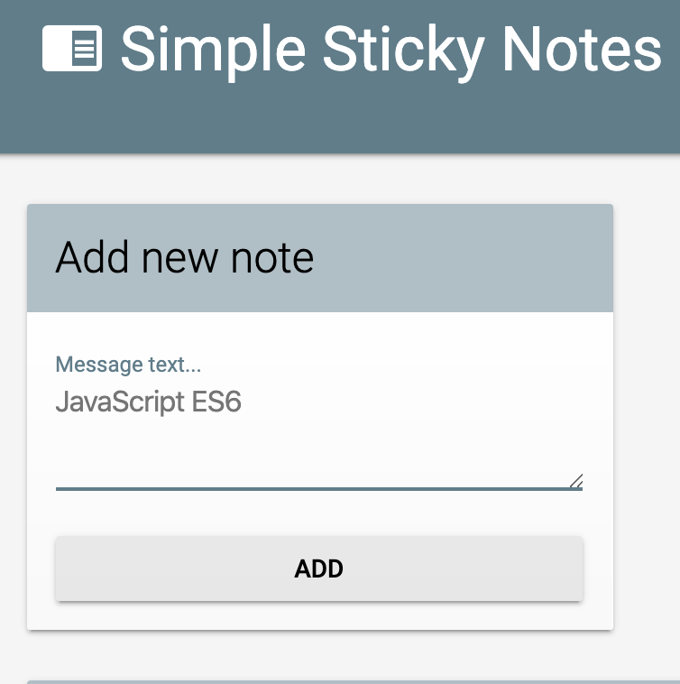
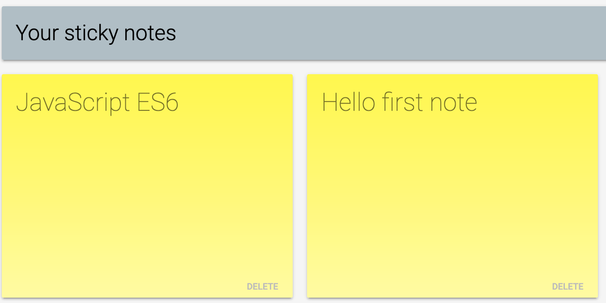

## Codelab: Building your first ES2015 app - JavaScript Sticky Notes

The app is called Simple Sticky Note. It lets you add notes to the page and saves all of these to <strong>local storage</strong>.

* <strong>Procfile</strong> is created to deploy to Heroku.
* To run this app locally, please run the following commands in your terminal window: 

<code> 
  git clone https://github.com/cathyli99/JS_StickyNotes.git  
  npm start  
</code>

Screenshots:

This repo contains the initial and final code for the [Building your first ES2015 app](http://www.code-labs.io/codelabs/chrome-es2015) codelab. (Not published yet! Working on it!)

